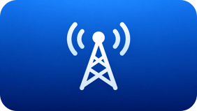

# Internet Radio for Apple TV 3

[← Bilingual README](README.md)



A native Internet Radio appliance for **jailbroken Apple TV 3 (A1469 / AppleTV3,2)**. Public packages are provided in **English** and **Chinese**.

> **Important: the current Radio implementation requires a Mac running ATV3Bridge Radio continuously. If the Mac is shut down, asleep, offline, or the bridge stops, Radio cannot normally load the station directory, search, favorites, or recent-play history. A station that is already playing may continue temporarily because the ATV3 connects directly to the station's audio stream after selection.**

## Architecture

**Apple TV 3 Radio → LAN HTTP → Mac ATV3Bridge Radio → HTTPS → Radio Browser**

After a station is selected:

**Apple TV 3 AVPlayer → the station's own HTTP/HTTPS audio stream**

ATV3Bridge is therefore required for normal browsing and station selection in this release, but it does not proxy the final audio stream.

## Features

- Global internet-radio directory
- Browse by country / region
- Browse by genre / tag
- A-Z station-name search
- Favorites
- Recently played stations
- Play, pause, and resume
- Automatic playback retry
- English and Chinese UI builds
- Favorites and recent history persisted by the Mac bridge

## public2 performance update

public2 carries the latest physical-device optimization: the dynamic Radio frame is encoded as JPEG instead of PNG, and the previous 0.75-second delayed refresh on entry has been replaced by an immediate frame update. This reduces both entry latency and perceived remote-control delay.

## Verified status

Target environment:

- Apple TV 3 A1469
- AppleTV3,2
- Apple TV Software 7.9 / build 12H1006
- iOS 8.4.4 base system

The manually deployed Chinese **Radio 0.3.1** currently on the physical ATV3 matches the latest Mac development executable exactly by MD5:

`bbcd705fbfbb497be4e304ce62044ebf`

The development build embedded the developer's private Mac LAN address, so that binary is **not published unchanged**. The public source reads the user's bridge base URL from:

`/var/root/.atv3-radio-bridge-url`

The public English and Chinese packages are rebuilt from the same sanitized final source and pass offline ARMv7, package, signature, privacy, and reproducibility checks. **The public .deb packages themselves have not yet received a separate physical-device installation acceptance test.**

## Download

Release:

https://github.com/ABoringBlog/Apple-TV-A1469-Jellyfin-Client-and-some-plugins/releases/tag/radio-v0.3.1-public2

Choose one package:

- `org.atv3.internetradio_0.3.1-public2-en_iphoneos-arm.deb` — English
- `org.atv3.internetradio_0.3.1-public2-zh_iphoneos-arm.deb` — Chinese

Both use package ID `org.atv3.internetradio`, so they are alternatives and cannot be installed side by side.

## 1. Run ATV3Bridge Radio on the Mac

Requires macOS and Python 3.

From the repository root:

```sh
cd Radio/Bridge
./install_launch_agent.sh
```

This creates the `org.atv3.bridge.radio` LaunchAgent so the bridge starts at login and remains running.

Check it with:

```sh
curl http://127.0.0.1:8100/health
```

### The Mac must remain available

ATV3Bridge is **not optional** in the current architecture:

- The Mac must remain powered on.
- It must not stay asleep while Radio is in use.
- The Mac and ATV3 must be mutually reachable on the LAN.
- `org.atv3.bridge.radio` must remain running.
- The Mac needs internet access to retrieve fresh directory data from Radio Browser.

If the bridge goes offline, an already playing stream may continue, but new directory, search, favorites, and recent-history requests will fail.

## 2. Configure the bridge URL on the ATV3

Find the Mac's LAN address, then run on the Apple TV:

```sh
echo 'http://MAC_LAN_IP:8100' > /var/root/.atv3-radio-bridge-url
```

Replace `MAC_LAN_IP` with the Mac's address. A DHCP reservation or static LAN IP is recommended.

## 3. Install Radio

English example:

```sh
scp org.atv3.internetradio_0.3.1-public2-en_iphoneos-arm.deb root@APPLE_TV_IP:/var/root/
ssh root@APPLE_TV_IP 'dpkg -i /var/root/org.atv3.internetradio_0.3.1-public2-en_iphoneos-arm.deb && launchctl stop com.apple.frontrow && launchctl start com.apple.frontrow'
```

Use the `-zh` package for Chinese.

If Radio was previously deployed manually, back up:

```text
/Applications/Radio.frappliance
/Applications/AppleTV.app/Appliances/Radio.frappliance
```

Migration from an unmanaged manual installation to the public package has not yet been separately validated on hardware.

## Bridge, network, and privacy

- The bridge listens on `0.0.0.0:8100` by default and currently has no authentication.
- **Use it only on a trusted LAN and do not expose port 8100 to the public internet.**
- The bridge contacts the public Radio Browser directory service.
- After station selection, the ATV3 connects directly to the third-party station audio URL.
- Favorites and recent history are stored in `Radio/Bridge/radio_state.json`; this file is ignored by Git and is not published.
- The repository does not publish the developer's private LAN IP, favorites, recent history, passwords, tokens, or API keys.

## Build from source

English:

```sh
make -C Radio LANGUAGE=en BUILD=build/radio-en radio
Radio/Scripts/package.sh en Radio/build/radio-en/Radio.frappliance Radio/build/package-en
```

Chinese:

```sh
make -C Radio LANGUAGE=zh BUILD=build/radio-zh radio
Radio/Scripts/package.sh zh Radio/build/radio-zh/Radio.frappliance Radio/build/package-zh
```

Requires macOS, Xcode Command Line Tools, and a compatible Theos/iPhoneOS SDK. Proprietary Apple SDKs are not included in this repository.

## License

Original Radio / ATV3Bridge Radio source and project documentation are released under the repository's [MIT License](../LICENSE).

Radio Browser, station names, artwork, audio streams, and other third-party content remain the property of their respective owners. This is an independent, unofficial project and is not affiliated with Apple.
