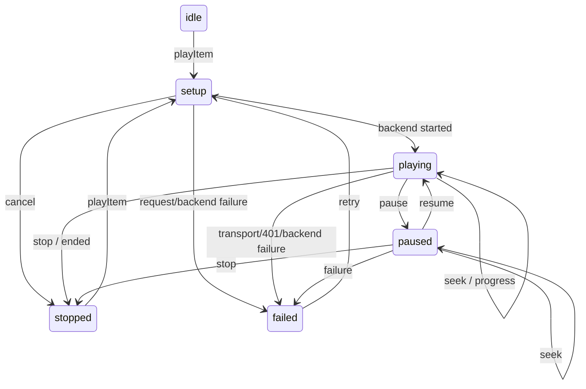

# 独立 playback layer

本阶段完成的是可在 Mac 执行的协商、请求、状态机与 UI 模型。没有 BackRow 私有播放器 adapter、媒体解码或设备性能证据。默认 appliance 没有 playback backend，因此不显示 Play；fixture 显式注入 JFMockPlaybackBackend 后可测试完整控制流程。mock 不读取媒体流，也不假装真实播放成功。

## ATV3 native backend foundation

`JFATV3PlaybackBackend` is the fail-closed 12H1006 adapter foundation. It runtime-checks the exact ARMv7 method encodings for `BRBaseMediaAsset`, `BRMediaPlayerManager`, `BRMediaPlayer` and `BRMediaPlayerController`, then can prepare a dynamic `JFJellyfinMediaAsset : BRBaseMediaAsset` and obtain a native player/controller without cueing, changing player state or presenting UI. The production appliance does not configure this backend yet. `startRequest:` deliberately reports failure until device probes prove presentation and authenticated asset loading.

The prepared asset exposes the Jellyfin media URL through the verified `BRMediaAsset` getter ABI. The original authenticated `NSURLRequest` is retained privately by the adapter, but there is currently no claim that BackRow propagates its `Authorization` header into the underlying `AVURLAsset` or HLS child requests. The 12H1006 executable imports `AVURLAssetHTTPHeaderFieldsKey`, but that symbol evidence alone is insufficient. Token query parameters remain forbidden; authenticated playback must stay disabled until header propagation is demonstrated on device.

## API 与数据流

`JFClient` 在同一个 `JFWorker` 上执行 `POST Items/{id}/PlaybackInfo`，body 包含用户、provisional DeviceProfile、StartTimeTicks、SubtitleStreamIndex 与 direct/transcode 开关。`JFPlaybackPlan` 校验来源列表、session/source ID、有限 ticks/时长和流元数据，输出 DirectPlay / DirectStream / Transcode 与 `provisional=YES`。无源、错误类型、无限/需打开的源、未知能力且无转码路径被拒绝。

规则按可用源优先 DirectPlay，再 DirectStream，再 Transcode。直接路径仅接受单路 H.264、8-bit SDR、≤1920×1080、≤30 fps、level≤4.0，以及单路 AAC ≤2 声道/48 kHz；MP4/M4V/MOV 可直放，其余容器需服务器允许 direct stream。HEVC/AV1/高位深/HDR/AC3 输入不直接交给播放器；仅有服务器许可且提供合法转码路径时请求 H.264/AAC SDR 输出，否则失败。这里的保守参数是 provisional 产品假设，不是 ATV3 的已验证能力表。

`playbackRequest:` 使用同源、同端口、同 reverse-proxy base path 的 Videos/{item}/…m3u8 地址，拒绝用户信息、fragment、外域和路径逃逸，移除 query 中 token/api_key，重新限定 codec/尺寸/帧率/bitrate 等参数。DirectPlay 构造 Videos/{id}/stream，包含 Static、MediaSourceId、PlaySessionId、StartTimeTicks。所有请求以 X-Emby-Token header 认证，关闭 cookies，不跟随重定向。`NSURLRequest` 含凭据，不得输出 description/headers；UI 快照没有这些请求。

StartTimeTicks 为 100 ns ticks。UI 从详情 UserData.PlaybackPositionTicks 读取有效值；负数或非整数视为 0，超出实际来源时长则 setup 拒绝。seek 小于 0 或大于 duration 拒绝；不默默改写位置。真正设备 adapter 需要把 ticks 与播放器时基转换，并确认流 URL/header/HLS 子请求与 seek 语义；这属于设备 API 阻塞项。

## 状态与所有权

close 是任意状态到 closed 的终态。接口在主线程使用，worker 独占 client。setup 的 task 可取消；代次在 play/seek/stop/logout/close 变化，旧 callback 不能复活已停用状态。seek 给 backend 新 event block，旧位置回调被丢弃。playing 时的倒退位置也被忽略；暂停时不接收 progress。backend 必须在主线程回调；异线程事件被拒绝。

通知和 progress/failure callback 可能重入关闭 UI。delivery box 不持有 controller，close 先解除 owner；调用处保留生命周期，复制 callback 后调用，避免回调中关闭释放造成悬空引用。控制器不自动重试失败播放。

JFSession 与浏览共享 client/worker。logout/login/close 先取消旧工作、废止播放代次，再按串行顺序清理会话。播放 401 清 token 并将 session/UI 返回登录；普通失败和 ended/stop 回到详情。详情返回、焦点与已有 UI lifecycle 继续使用 Phase 4D 的受检接口，无新增播放器私有 selector。

## 上报

backend 确认 started 才发 `Sessions/Playing`，不是 PlaybackInfo 返回即当作已播放。pause/resume/seek 发送 Progress，普通位置变化至少相隔 10 秒 ticks 且只允许一个在途周期 Progress。stop/ended/失败发送一次 Stopped（未 started 则不发）；serial worker 保序。上报包含 ItemId、MediaSourceId、PlaySessionId、PositionTicks、PlayMethod、IsPaused 与 CanSeek。

上报 401 视为会话失效，不循环重试；网络错误上报失败同样会失败收口。取消不能撤销已被服务器处理的 POST；网络断开或进程退出时 Stopped 只能 best effort，不能保证远端收到。测试验证的是请求和状态合同，未验证真实服务器转码/会话显示。

## 证据

Tests/playback.m 覆盖模型、subtitle、取消/代次/回调释放/401；Tests/ui.m 覆盖菜单注入；Tests/playback_http.m 用真实 Mac socket 执行请求与错误边界。ASan 覆盖播放、UI、session；不等于设备 leak/performance 测试。

Jellyfin 接口依据固定 v10.10.7 官方源码：
- [PlaybackInfoDto](https://github.com/jellyfin/jellyfin/blob/v10.10.7/Jellyfin.Api/Models/MediaInfoDtos/PlaybackInfoDto.cs)
- [MediaInfoController](https://github.com/jellyfin/jellyfin/blob/v10.10.7/Jellyfin.Api/Controllers/MediaInfoController.cs)
- [PlaystateController](https://github.com/jellyfin/jellyfin/blob/v10.10.7/Jellyfin.Api/Controllers/PlaystateController.cs)
- [ProfileConditionValue](https://github.com/jellyfin/jellyfin/blob/v10.10.7/MediaBrowser.Model/Dlna/ProfileConditionValue.cs)

请求/响应结构参考这些接口；所部署服务器版本仍需 integration 验证。设备 profile 参数来自本项目保守假设，不能用服务器接口存在来证明硬件支持。
